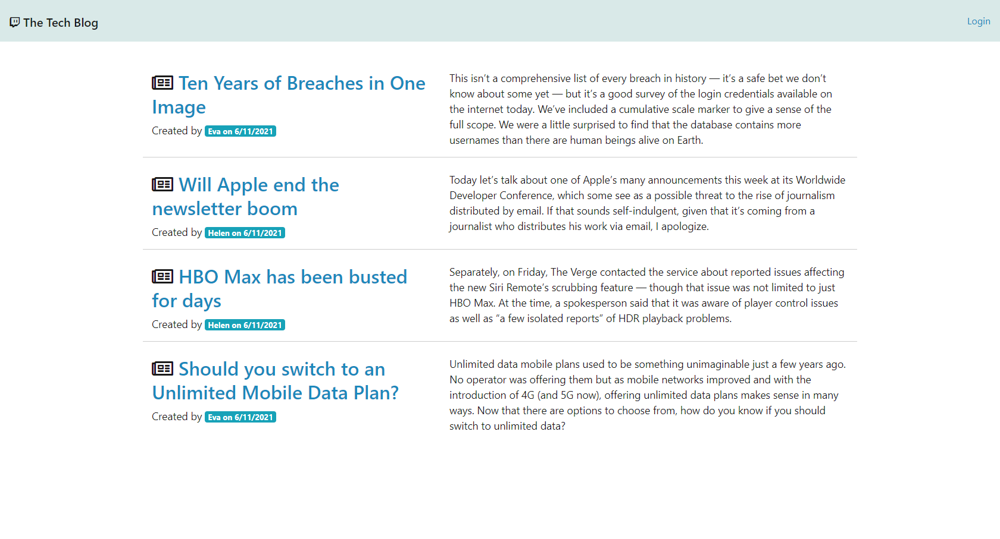
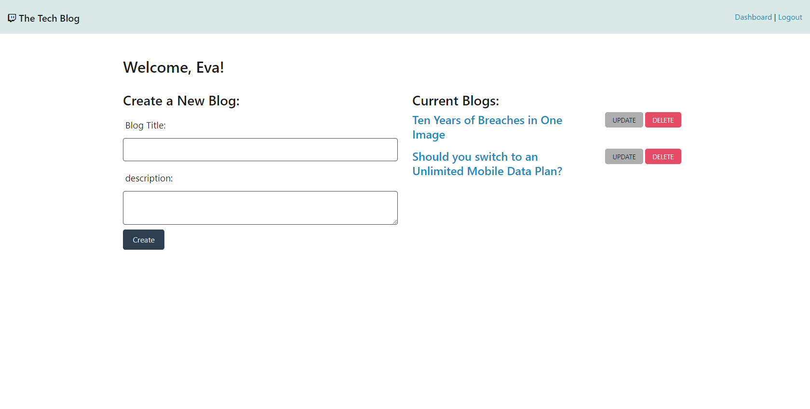

# Model-View-Controller (MVC): Tech Blog

### Table of Contents

- [Description](#description)
- [Installation](#installation)
- [Usage](#usage)
- [Contribution](#contribution)
- [License](#license)

## Description

This project is a CMS style blog site. In this project developers can login and publish their blog posts and comment on other developers’ posts as well.

User Story
AS A developer who writes about tech
I WANT a CMS-style blog site
SO THAT I can publish articles, blog posts, and my thoughts and opinions

## Mock up

## Home Page

## Blog Detail Page

## Dashboard

## Installation

This site is deployed at https://damp-badlands-21790.herokuapp.com/

## Usage

The user first needs to create login details. After logging in, user can publish article. The user can also view other users article and comment on the article as well. User can edit and delete their articles as well. 

## Contribution

Please feel free in making contribution to this repository. But please first discuss the change via email with me. I will try to get back to you as soon as possible.

## Questions

If you have any questions feel free to contact me:

Github Username: sona29

Email: sona.shrestha004@gmail.com

## License

